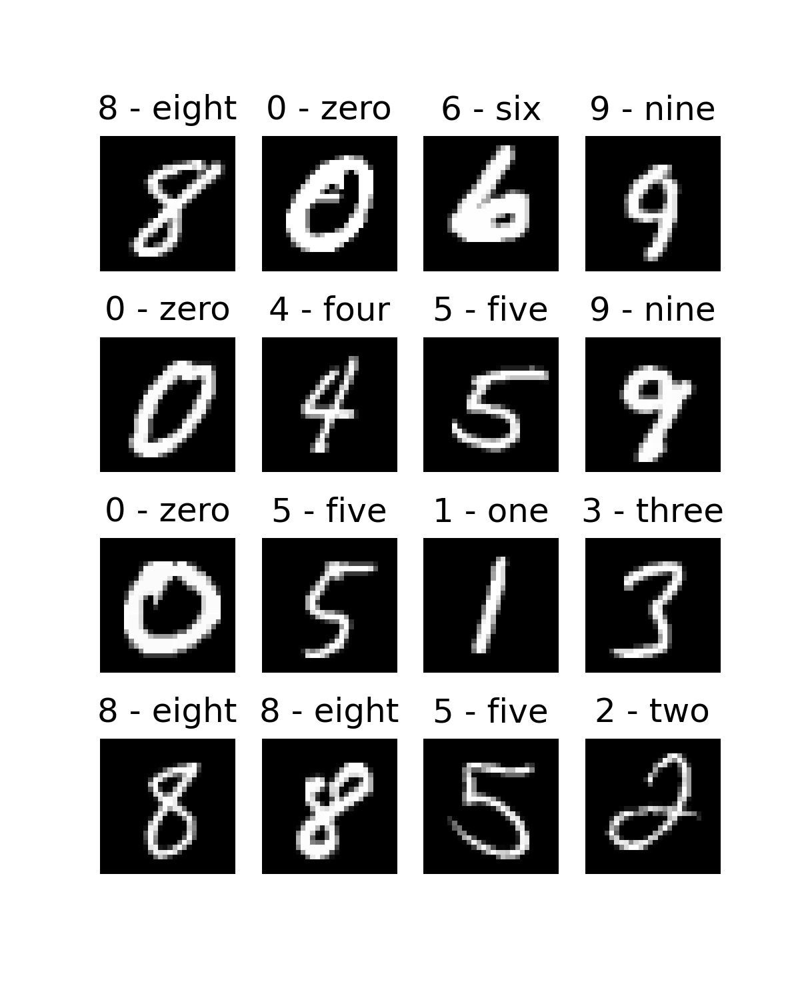
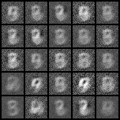
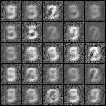
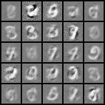
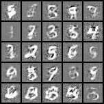
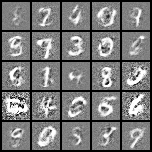
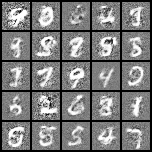
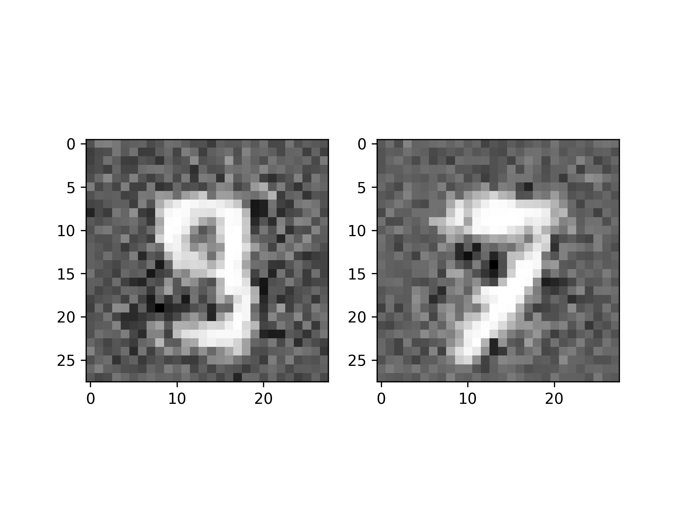
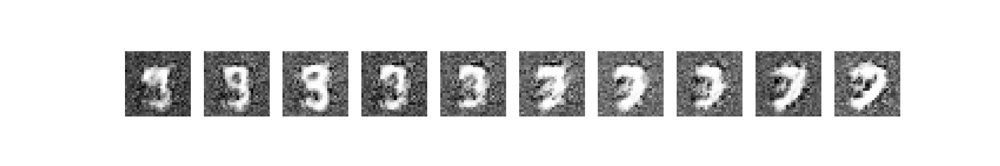

**[Generative Adversarial Nets](https://github.com/All4Nothing/papers-repo/tree/main/Generative%20Adversarial%20Nets)**

**DataLoader Example**
  

**G(z), 0 iter, 1000 iter, 10000 iter, 100000 iter, 187000 iter, Generator Image**  
.png)

  

  
**Side Images**  
  
**Interpolation**  

